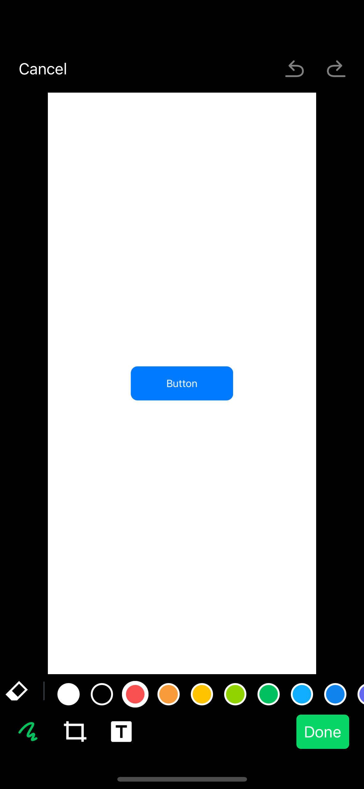

[](https://cocoapods.org/pods/LWPhotoEditor)
[](https://raw.githubusercontent.com/logicwind/LWPhotoEditor/master/LICENSE)
[](https://img.shields.io/badge/Platforms-iOS-blue?style=flat)




LWPhotoEditor is a powerful image editor framework. Supports draw,cropping, text stickers.

### Directory
* [Features](#Features)
* [Description](#Description)
* [Requirements](#Requirements)
* [Usage](#Usage)
* [Change Log](#ChangeLog)
* [Languages](#Languages)
* [Installation(Support Cocoapods)](#Installation)

### <a id="Features"></a>Features
- [⭐️] Draw (Support custom line color).
- [⭐️] Crop (Support custom crop ratios).
- [⭐️] Text sticker  (Support custom text color).

### <a id="Description"></a>Description

#### UI Enhancements in the Editing Screen

- This fork of ZLImageEditor introduces a refined UI layout to enhance the editing experience, with a specific focus on Crop Image, Draw Image, and Text Sticker functionalities.

##### Previous UI (Before Enhancements)

- The image was displayed in full-screen mode, occupying the entire screen.
Editing tools (Crop, Draw, and Text Stickers) were positioned as overlays on the image at the bottom.
- The Cancel, Redo, and Undo buttons were placed at the top of the screen, overlaying the image.

##### Updated UI (After Enhancements)

- The image is now centered on the screen, improving focus and usability.
Editing tools (Crop, Draw, and Text Stickers) are now placed below the image, creating a clean and distraction-free interface.
- The Cancel, Redo, and Undo buttons remain at the top of the screen but are now separated from the image, removing any visual obstructions.

##### Future Enhancements

- All features of ZLImageEditor remain unchanged in this version, while Crop, Draw, and Text Stickers have been improved by removing overlays and implementing NSLayoutConstraints for a more structured editing screen.
- Future updates will introduce further UI enhancements, expanded customization options, and refinements to additional functionalities of ZLImageEditor in this fork pod.

##### Further improvements are planned for upcoming releases—stay tuned! 🚀


### <a id="Requirements"></a>Requirements
 | v >= 2.0.0 | iOS 10.0+ |
 | --- | --- |
 | v \< 2.0.0 | iOS 9.0+ |
 * Swift 5.x
 * Xcode 12.x

### <a id="Usage"></a>Usage
```swift
ZLImageEditorConfiguration.default()
    .editImageTools([.draw, .clip, .textSticker])

ZLEditImageViewController.showEditImageVC(parentVC: self, image: image, editModel: editModel) { [weak self] (resImage, editModel) in
    // your code
}
```

### <a id="ChangeLog"></a>Change Log
> [More logs](https://github.com/logicwind/LWPhotoEditor/blob/master/CHANGELOG.md)
```
● 0.1.0
  Refined UI: Centered image, repositioned tools, removed overlays, and added NSLayoutConstraint for better layout.
...
```

### <a id="Languages"></a>Languages
🇨🇳 Chinese (Simplified/Traditional), 🇺🇸 English, 🇯🇵 Japanese, 🇫🇷 French, 🇩🇪 German, 🇺🇦 Ukranian, 🇷🇺 Russian, 🇻🇳 Vietnamese, 🇰🇷 Korean, 🇲🇾 Malay, 🇮🇹 Italian, 🇮🇩 Indonesian, 🇪🇸 Spanish, 🇵🇹 Portuguese, 🇹🇷 Turkey, 🇸🇦 Arabic, 🇳🇱 Dutch.

### <a id="Installation"></a>Installation

#### CocoaPods
To integrate LWPhotoEditor into your Xcode project using CocoaPods, specify it to a target in your Podfile:

```
source 'https://github.com/CocoaPods/Specs.git'
platform :ios, '10.0'
use_frameworks!

target 'MyApp' do
  # your other pod
  # ...
  pod 'LWPhotoEditor'
end
```

Then, run the following command:

```
$ pod install
```

> If you cannot find the latest version, you can execute `pod repo update` first

### <a id="Credits"></a>🎖Credits  

This is fork of [ZLImageEditor](https://github.com/longitachi/ZLImageEditor.git).  
Big thanks to the original authors for their contributions! 🚀  

